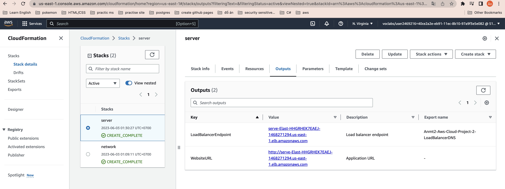

## Project Title - Deploy a high-availability web app using CloudFormation
This folder provides the starter code for the "ND9991 - C2- Infrastructure as Code - Deploy a high-availability web app using CloudFormation" project. This folder contains the following files:


### final-project-starter.yml
Students have to write the CloudFormation code using this YAML template for building the cloud infrastructure, as required for the project. 

### server-parameters.json
Students may use a JSON file for increasing the generic nature of the YAML code. For example, the JSON file contains a "ParameterKey" as "EnvironmentName" and "ParameterValue" as "UdacityProject". 

In YAML code, the `${EnvironmentName}` would be substituted with `UdacityProject` accordingly.

## How to run
1. Create network:
```
./create.sh network ./network/config.yml ./network/params.json
```

2. Create server:
```
./create.sh server ./server/config.yml ./server/params.json
```
**Notes**: You can change `network`, `server` to other name. 

3. Delete server
```
./delete.sh server
```

4. Delete network
```
./delete.sh network
```

## Result
[Link Web](http://serve-elast-hhgrhek7eaej-1468271294.us-east-1.elb.amazonaws.com/)

### Final Result


### Network Resources


### Network Outputs


### Server Resources


### Server Outputs
