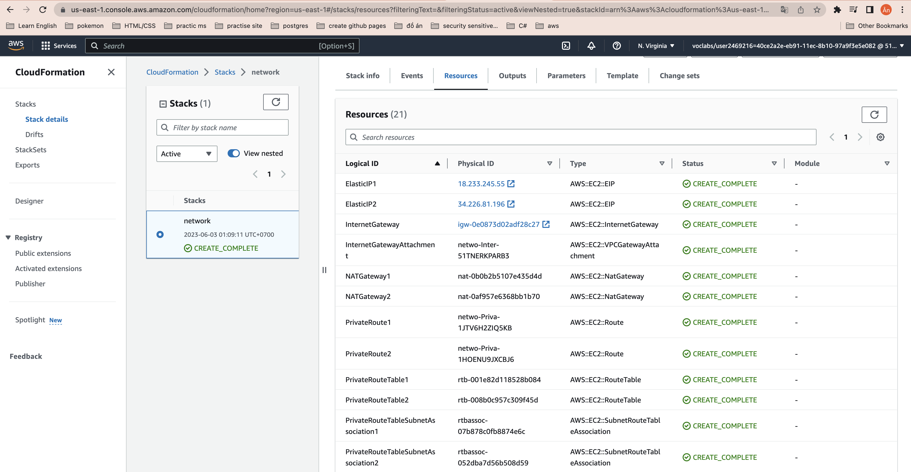

## Project Title - Deploy a high-availability web app using CloudFormation
This folder provides the starter code for the "ND9991 - C2- Infrastructure as Code - Deploy a high-availability web app using CloudFormation" project.

## How to run
1. Create network:
```
./create.sh network ./network/config.yml ./network/params.json
```

2. Create server:
```
./create.sh server ./server/config.yml ./server/params.json
```

3. Delete server
```
./delete.sh server
```

4. Delete network
```
./delete.sh network
```

## Result
[Link Web](http://serve-elast-hhgrhek7eaej-1468271294.us-east-1.elb.amazonaws.com/)

### Final Result


### Network Resources


### Network Outputs


### Server Resources


### Server Outputs
